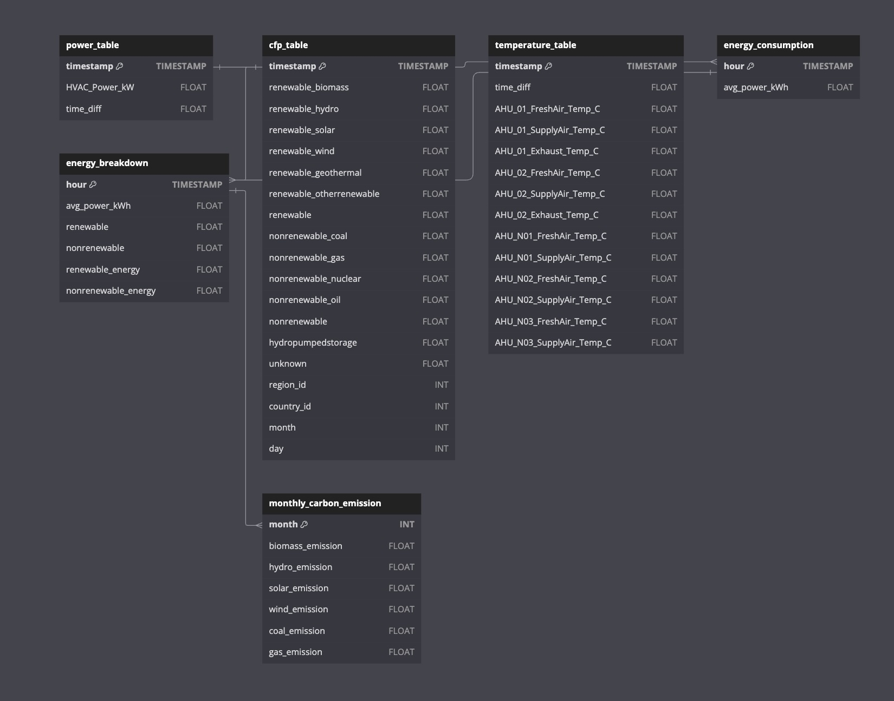
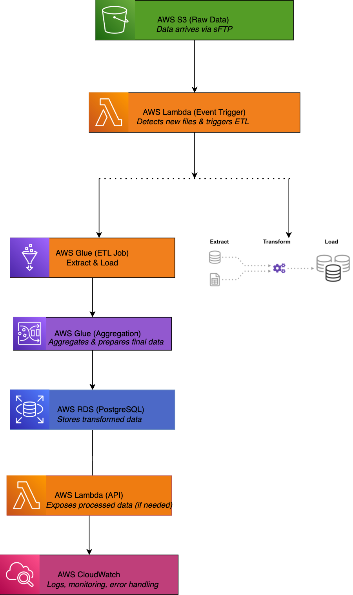

# Builtrix Data Engineering Challenge

## 1. Introduction

### Overview

The **Builtrix Data Engineering Challenge** involves designing an end-to-end data pipeline that processes energy consumption data, carbon footprint metrics, and temperature records. The challenge required ingesting raw datasets, cleaning and transforming the data, storing it in a relational database, and generating insights through data aggregation and carbon emission calculations.

### Dataset Used

- **Energy Consumption Data** (15-minute intervals) from `energy_data.xlsx`
- **Carbon Footprint (CFP) Data** (hourly timestamps) from AWS S3 `cfp-data/`
- **Temperature Data** (15-minute intervals) from energy datasets

### Purpose of Data Processing Steps

1. **Ingestion:** Extract data from different sources (Excel, CSVs from AWS S3).
2. **Cleaning & Preprocessing:** Standardize timestamps, handle missing values, resample data.
3. **Database Storage:** Design PostgreSQL schema and load data using bulk inserts.
4. **Aggregation & Analysis:** Compute hourly energy consumption, energy breakdown, and monthly carbon emissions.
5. **Reporting & Validation:** Generate data quality reports and validate pipeline results.

## Project Structure

📂 Builtrix-data-challenge
 ├── 📂 data
 │   ├── 📂 raw             # Raw data (original files)
 │   ├── 📂 processed       # Processed & cleaned data
 │   ├── 📂 cleaned         # Final transformed data
 │   ├── 📂 reports         # Data quality reports
 │   ├── 📂 output          # Exported tables from PostgreSQL (Energy_Consumption.csv, Energy_Breakdown.csv)
 ├── 📂 sql
 │   ├── 01_create_tables.sql       # Schema for PostgreSQL tables
 │   ├── 02_data_aggregation.sql    # Aggregation queries for Energy Consumption & Breakdown
 │   ├── 03_carbon_emission_view.sql # View for Monthly Carbon Emission
 ├── 📂 diagrams
 │   ├── architecture_diagram.png  # AWS ETL pipeline diagram from Document B
 │   ├── erd_diagram.png           # Entity-Relationship Diagram (ERD)
 ├── execute_sql_scripts.py        # Runs all SQL scripts for table creation & data processing
 ├── ingest_cfp_data.py            # Fetches Carbon Footprint (CFP) data from AWS S3
 ├── ingest_energy_data.py         # Downloads energy dataset from energy_data.xlsx
 ├── process_energy_data.py        # Cleans, transforms, and resamples energy data
 ├── upload_to_postgres.py         # Loads processed data into PostgreSQL tables
 ├── README.md                     # Documentation of the project

## 2. Data Ingestion & Processing

### Data Ingestion

- The raw **energy data** was downloaded from `energy_data.xlsx` and processed into CSVs.
- The **carbon footprint (CFP) data** was fetched dynamically from AWS S3, iterating through months and days.
- The **temperature data** was extracted and transformed similarly to energy data.

### Preprocessing Steps

- **Timestamp standardization** (`YYYY-MM-DD HH:MM:SS` format)
- **Handling missing values** via forward fill and interpolation
- **Resampling & aggregation** to align timestamps across datasets
- **Data quality reporting** to track missing percentages and duplicates

### Key Code Snippets

#### Downloading Energy Data

```python
import requests
import os

ENERGY_FILE_URL = "https://buitrix-challenge-01.s3.amazonaws.com/energy_data.xlsx"
DATA_DIR = "data/raw"
os.makedirs(DATA_DIR, exist_ok=True)
ENERGY_FILE_PATH = os.path.join(DATA_DIR, "energy_data.xlsx")

response = requests.get(ENERGY_FILE_URL)
if response.status_code == 200:
    with open(ENERGY_FILE_PATH, 'wb') as f:
        f.write(response.content)
    print("Energy data downloaded successfully.")
```

#### Processing Carbon Footprint Data from AWS S3

```python
for month in range(1, 13):
    for day in range(1, 32):
        cfp_url = f"https://buitrix-challenge-01.s3.amazonaws.com/cfp-data/month={month}/day={day}/entsoe.csv"
        response = requests.get(cfp_url)
        if response.status_code == 200:
            print(f"Downloaded: {cfp_url}")
```

#### Data Cleaning & Resampling

```python
df['timestamp'] = pd.to_datetime(df['timestamp'])
df = df.set_index('timestamp').resample('15T').mean().reset_index()
df.fillna(method='ffill', inplace=True)
```

---

## 3. Database Schema, Queries & Data

### ER Diagram (Entity-Relationship Diagram)

The database consists of **three primary tables**:

1. **`power_table`** - Stores 15-minute interval energy consumption data.
2. **`cfp_table`** - Stores hourly energy mix percentages.
3. **`temperature_table`** - Stores temperature readings at 15-minute intervals.





#### SQL Table Creation Scripts

```sql
CREATE TABLE power_table (
    timestamp TIMESTAMP PRIMARY KEY,
    HVAC_Power_kW FLOAT,
    time_diff FLOAT
);

CREATE TABLE cfp_table (
    timestamp TIMESTAMP PRIMARY KEY,
    renewable_biomass FLOAT,
    renewable_hydro FLOAT,
    renewable_solar FLOAT,
    renewable_wind FLOAT,
    renewable_geothermal FLOAT,
    nonrenewable_coal FLOAT,
    nonrenewable_gas FLOAT,
    region_id INT,
    country_id INT,
    month INT,
    day INT
);

CREATE TABLE temperature_table (
    timestamp TIMESTAMP PRIMARY KEY,
    time_diff FLOAT,
    AHU_01_FreshAir_Temp_C FLOAT,
    AHU_01_SupplyAir_Temp_C FLOAT
);
```

### Data Aggregation & Carbon Emission Queries

#### Compute Hourly Energy Consumption

```sql
CREATE TABLE energy_consumption AS
SELECT
    DATE_TRUNC('hour', timestamp) AS hour,
    AVG(HVAC_Power_kW) AS avg_power_kWh
FROM power_table
GROUP BY hour;
```

#### **Compute Energy Breakdown by Source**

```sql
CREATE TABLE Energy_Breakdown AS
SELECT
    ec.hour,
    ec.avg_power_kWh,
    cfp.renewable,
    cfp.nonrenewable,
    (ec.avg_power_kWh * cfp.renewable) AS renewable_energy,
    (ec.avg_power_kWh * cfp.nonrenewable) AS nonrenewable_energy
FROM Energy_Consumption ec
JOIN cfp_table cfp
ON ec.hour = cfp.timestamp;
```

#### Compute Carbon Emissions

```sql
CREATE VIEW monthly_carbon_emission AS
SELECT
    month,
    SUM(total_energy_kwh * renewable_biomass * 222.5) AS biomass_emission,
    SUM(total_energy_kwh * renewable_hydro * 12) AS hydro_emission
FROM cfp_table
GROUP BY month;
```

---

## 4. Final Outputs

### **Data Validation: Row Counts**

Query:

```
SELECT COUNT(*) AS power_table_count FROM power_table;
SELECT COUNT(*) AS cfp_table_count FROM cfp_table;
```

Output:

| Table           | Row Count |
| --------------- | --------- |
| `power_table` | 35,037    |
| `cfp_table`   | 33,212    |

### **Energy Consumption (Hourly Aggregation)**

Query:

```
SELECT * FROM Energy_Consumption LIMIT 10;
```

Output:

| hour                | avg_power_kwh |
| ------------------- | ------------- |
| 2022-09-08 21:00:00 | 380.71        |
| 2022-06-04 23:00:00 | 104.40        |
| 2022-01-04 12:00:00 | 343.04        |
| 2022-07-03 09:00:00 | 362.25        |
| 2022-01-10 00:00:00 | 101.09        |

### **Energy Breakdown (Energy Mix by Source)**

Query:

```
SELECT * FROM Energy_Breakdown LIMIT 10;
```

Output:

| hour                | avg_power_kwh | renewable | nonrenewable | renewable_energy | nonrenewable_energy |
| ------------------- | ------------- | --------- | ------------ | ---------------- | ------------------- |
| 2022-09-08 21:00:00 | 380.71        | 0.65      | 0.35         | 247.46           | 133.25              |
| 2022-06-04 23:00:00 | 104.40        | 0.50      | 0.50         | 52.20            | 52.20               |

### **Monthly Carbon Emission Report**

Query:

```
SELECT * FROM Monthly_Carbon_Emission LIMIT 10;
```

Output:

| month      | renewable_emissions | nonrenewable_emissions | total_emissions |
| ---------- | ------------------- | ---------------------- | --------------- |
| 2022-01-01 | 10,567.50           | 255,600.00             | 266,167.50      |
| 2022-02-01 | 11,230.75           | 280,350.00             | 291,580.75      |

---

## 5. Execution Steps

1. **Run Data Ingestion Scripts:**
   ```bash
   python scripts/download_energy_data.py
   python scripts/download_cfp_data.py
   ```
2. **Run Data Cleaning & Processing:**
   ```bash
   python process_data.py
   ```
3. **Load Data into PostgreSQL:**
   ```bash
   python upload_to_postgres.py
   ```
4. **Execute SQL Aggregations & Carbon Emission Calculations:**
   ```bash
   python execute_sql_scripts.py
   ```

---

## 6. Architecure


